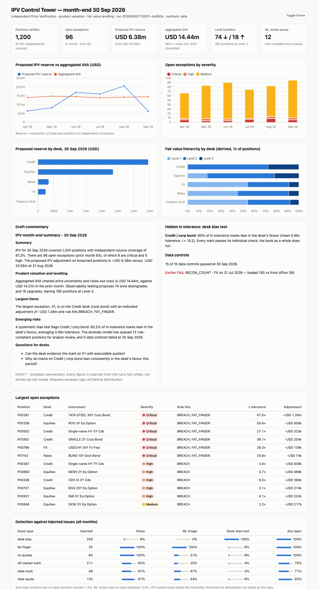
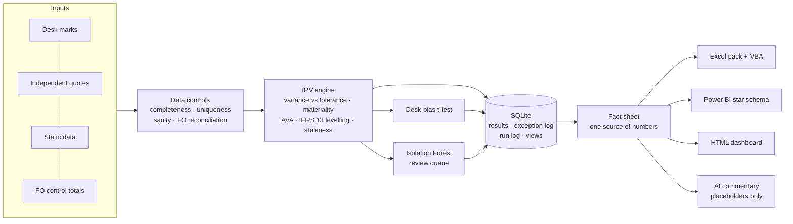

# IPV Control Tower

**An automated Independent Price Verification (IPV) and valuation-control process for a
trading book: data controls, price verification, prudent valuation (AVA), fair value
levelling, ML-assisted triage, an Excel/VBA pack, a Power BI model and guard-railed
AI commentary.**



---

## The problem

Every month-end, a bank's valuation control team has to show that the prices its
trading desks use to mark positions are fair. Desks mark their own books, which
creates an obvious conflict of interest, so an independent team checks each mark
against external sources (broker quotes, consensus services, exchange closes), books
reserves where the desk is off-market, sets prudent-valuation capital deductions, and
classifies each position in the IFRS 13 fair value hierarchy.

Done by hand, this means thousands of rows, dozens of spreadsheets and a tight
deadline, and the dangerous errors are the quiet ones: a mark that stopped moving three
months ago, or a whole book leaning 0.5× tolerance in the desk's favour while every
single mark still "passes".

This project automates the month-end run end to end and measures how well it catches
problems.

## Results (1,200 positions × 6 month-ends, synthetic data)

| | |
|---|---|
| Full month-end run (load → 90 data controls → 7 rules on 7,199 position-months → ML → reports) | **1.3 s** |
| Independent-source coverage | 97.2% |
| Fat-fingers and missing-quote positions caught by rules | **100%** |
| Hidden desk bias caught (every mark was inside tolerance, so rules alone caught 9%) | **100%** with the desk-bias test |
| Records dropped between front office and IPV feed | 1 of 1 caught by reconciliation |
| Rule false-positive rate on clean position-months | 1.4% |
| Extra catch from the ML queue and bias test on top of rules | +10 pp off-market marks, +5 pp stale quotes, +4 pp stale marks |

Issues are injected into the synthetic book with ground-truth labels that the engine
never reads, so these detection rates are measured, not assumed. The full matrix is
reproduced by `make run` and is on the *Detection* sheet of the Excel pack.

| Injected issue | n | Rules | ML triage | Desk-bias test | Any layer |
|---|---:|---:|---:|---:|---:|
| Desk bias (inside tolerance) | 258 | 9% | 0% | **100%** | 100% |
| Fat-finger mark | 35 | **100%** | 100% | 6% | 100% |
| No independent quote | 84 | **100%** | 31% | 8% | 100% |
| Off-market mark | 211 | 65% | 25% | 4% | 75% |
| Stale (frozen) mark | 49 | 67% | 47% | 0% | 71% |
| Stale quote | 133 | 87% | 44% | 6% | 92% |

Off-market marks that are missed are, by design, below the USD 25k materiality
threshold. Stale marks are only flagged once they have been frozen for three
month-ends, so the first two months of each freeze are missed on purpose.

## How it maps to the role

| JD asks for | Where it is in this project |
|---|---|
| *Review position marks, perform checks and analysis* | [ipv/checks.py](ipv/checks.py): tolerance checks by asset class and fair value level, materiality, fat-finger, stale quote and stale mark, mark-vs-market movement |
| *Ensure compliance with key regulatory requirements* | Prudent valuation AVAs (EBA RTS on prudent valuation, core approach: market price uncertainty and close-out cost, 50% aggregation), IFRS 13 levelling from input observability, four-eyes sign-off enforced by a database constraint |
| *Strengthen controls, reduce manual effort through automation* | Completeness, uniqueness, referential and quote-sanity checks, plus front-office reconciliation before any valuation check runs. Exception log that survives reruns and ages items. Config and input hashes on every run. |
| *Power BI dashboards, valuation reporting* | Star-schema export plus [DAX measures](powerbi/measures.dax) and a [build guide](powerbi/README.md); HTML dashboard; formatted Excel pack with named tables |
| *Python, Excel macros, Access database* | Python pipeline; [VBA toolkit](excel/IPV_Toolkit.bas) (desk filters, desk packs, Outlook drafts, sign-off checks and export); SQLite database with an ANSI [schema](sql/schema.sql) and [views](sql/views.sql) that port to Access |
| *Experimental and responsible use of AI* | Isolation Forest review queue, plus [AI commentary](ipv/ai_commentary.py) in which the model cannot write a number (see below) |
| *Strategic thinker, communication* | The desk-bias test targets a risk that per-position checks can't see by design. Month-end commentary and desk emails are drafted automatically. |

## Architecture



## What each check does

All variances are expressed in the asset class's own unit (price points, bp, pips, vol
points), so one tolerance table covers bonds, swaps, FX forwards, options and CDS.

| Check | Rule | Why |
|---|---|---|
| **Price variance** | `variance = (desk mark − median quote) × scale`; breach when `|variance| > tolerance[asset, level]` **and** `|PV impact| ≥ USD 25k` | Tolerance alone floods the queue with immaterial items; materiality alone misses large books with small errors |
| **PV adjustment** | `sensitivity × (consensus − mark)`; negative means the desk mark flatters P&L | This is the reserve that would be booked |
| **Fat-finger** | `|variance| > 20 × tolerance` → CRITICAL | Keying errors need same-day attention, whatever the size |
| **AVA, market price uncertainty** | `|sensitivity| × quote range / 2`; full tolerance if fewer than 2 quotes | Capital deduction for valuation uncertainty; unobservable positions are treated conservatively |
| **AVA, close-out cost** | `|sensitivity| × bid/ask / 2` | Cost of exiting at mid |
| **IFRS 13 levelling** | L1 needs an exchange close in an active market; L3 if fewer than 2 quotes or the range is above 3× the L2 tolerance; L3 bookings are only upgraded on 3+ tight quotes | Levelling follows the observability of the inputs, not the booking |
| **Stale quote / stale mark** | Quote older than the asset class's cut-off; mark unchanged for 3+ month-ends | Frozen marks pass variance checks while the stale quote is still being used |
| **Desk bias** | Point each in-tolerance variance in the direction that flatters the desk; flag a desk/asset class when t > 4 and the mean is above 0.25× tolerance | Every mark can pass while the book as a whole leans the desk's way |
| **ML triage** | Isolation Forest on tolerance ratio, dispersion, missing quotes, quote age, mark-vs-market move gap and mark age | Surfaces combinations that break no single rule. It only ranks a review queue and never raises exceptions itself. |

## Responsible AI: the model never writes a number

LLM commentary is useful, but a single invented figure in a valuation report is a
control failure. [ipv/ai_commentary.py](ipv/ai_commentary.py) makes that failure
impossible by construction:

1. **Data minimisation.** Only aggregated, pre-formatted facts are sent. The top
   exceptions go as aliases X1–X5, with the mapping kept locally, so no position IDs,
   raw marks or counterparties leave the machine.
2. **Numbers by reference.** Claude (`claude-opus-5`, structured JSON output) writes
   `{breach_adj_usd}`-style placeholders and is told never to type a digit. Every
   sentence is validated locally. A digit outside a placeholder (other than an
   allowlist: X1–X5, Level 1–3, IFRS 13) or an unknown key causes that sentence to be
   dropped and logged. Placeholders are then filled from the same fact sheet that
   feeds the Excel pack, so the commentary and the pack always agree.
3. **Graceful degradation.** A refusal, a truncated response, an API error or missing
   credentials all fall back to a deterministic template, which passes through the
   same validator. The validator caught "Level 3" in the first version of that
   template, which is how the allowlist came about.
4. **Human in the loop.** Output is stamped DRAFT and needs reviewer sign-off.
   Nothing is sent automatically, and the Outlook macro only creates drafts.
5. **Audit trail.** Each call appends the system-prompt hash, the facts sent, the raw
   response and every rejected sentence to `ai_audit.jsonl`.

Sample output: [docs/sample_commentary.md](docs/sample_commentary.md).

## Quickstart

Requires [uv](https://docs.astral.sh/uv/).

```sh
make setup        # Python 3.12 venv + dependencies
make run          # month-end run -> output/
make test         # 21 tests
make dashboard    # run and open the HTML dashboard

make run-ai       # AI-drafted commentary (needs ANTHROPIC_API_KEY or `ant auth login`)
```

Outputs in `output/`:

| File | What it is |
|---|---|
| `dashboard.html` | Single-file dashboard, light and dark mode ([sample](docs/sample_dashboard.html)) |
| `IPV_Pack_YYYYMM.xlsx` | Summary, Exceptions, Desk_Trend, AVA, Level_Transfers, ML_Review, Desk_Bias, Controls, Detection, Config |
| `ipv.db` | SQLite: inputs, results by `run_id`, exception log, run log, views |
| `powerbi/*.csv` | Star schema for the Power BI model |
| `commentary.md`, `ai_audit.jsonl` | Draft commentary and its audit log |

### Exception workflow

```sh
# four-eyes sign-off from the command line
python -m ipv signoff EXC-P00287-202609 --reviewer analyst.b --status ADJUSTED \
    --comment "Fat-finger confirmed by desk; mark corrected."

# or: reviewers fill in the Exceptions sheet, run the ExportSignOffs macro, then
python -m ipv signoffs-import signoffs_20261001_0930.csv
```

A reviewer who is also the preparer is rejected by a `CHECK` constraint in the database,
not by application code. An exception that persists across month-ends stays one item
with an age, and human status and commentary are never overwritten by a rerun.

## Repository layout

```
ipv/
  config.py          every threshold in one place (hashed into each run)
  generate.py        synthetic book with labelled, injected issues
  checks.py          data controls, IPV, AVA, levelling, staleness, desk bias
  anomaly.py         Isolation Forest review queue
  evaluate.py        detection rates against ground truth
  db.py              SQLite load/store, exception log, sign-off
  facts.py           month-end fact sheet (single source of numbers)
  ai_commentary.py   guard-railed Claude commentary + template fallback
  pipeline.py        orchestration and run log
  reporting/         excel.py · powerbi.py · dashboard.py
sql/                 schema.sql · views.sql
excel/               IPV_Toolkit.bas (VBA)
powerbi/             measures.dax · README.md (model build guide)
tests/               unit, guardrail and end-to-end tests
docs/                sample dashboard, commentary, screenshot
```

## Limitations and honest caveats

- **The data is synthetic.** Real position and market data can't be published. The
  generator is calibrated so that tolerances, quote counts, level mix and transfer
  rates (about 7% of position-months) look plausible, but the detection rates
  describe this simulation, not a production book.
- **AVAs are simplified.** Only market price uncertainty and close-out cost are
  modelled, using a quote-range proxy for the 90% confidence interval. Model risk,
  concentration, unearned credit spread and the other AVA categories are out of scope.
- **Sensitivities are linear.** The PV impact uses first-order sensitivities, which is
  standard for IPV screening but understates convex positions such as deep OTM options.
- **SQLite stands in for Access or SQL Server.** The schema is plain ANSI SQL, and the
  only change needed to port it is renaming types.
- **The live Claude call is tested with mocked responses.** Tests cover a valid draft, a
  sentence with an invented number, and a refusal, but not a real API round-trip. The
  default offline run needs no API key.

## What I'd build next

- Bid/offer-aware tolerances that widen automatically in stressed markets (VIX, CDX
  regime), instead of static tables
- A drill-through that shows each position's mark vs consensus history, to support
  desk challenge meetings
- Scheduled runs that email desks their Outlook drafts for approval each morning of
  the close
